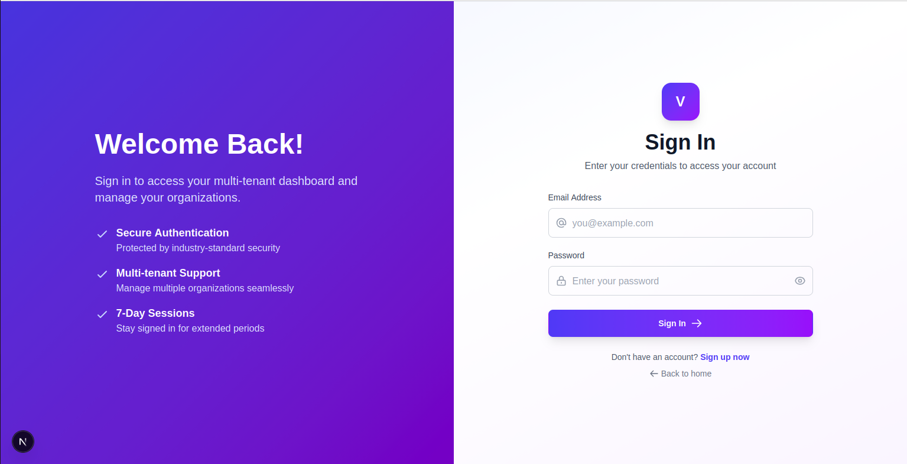
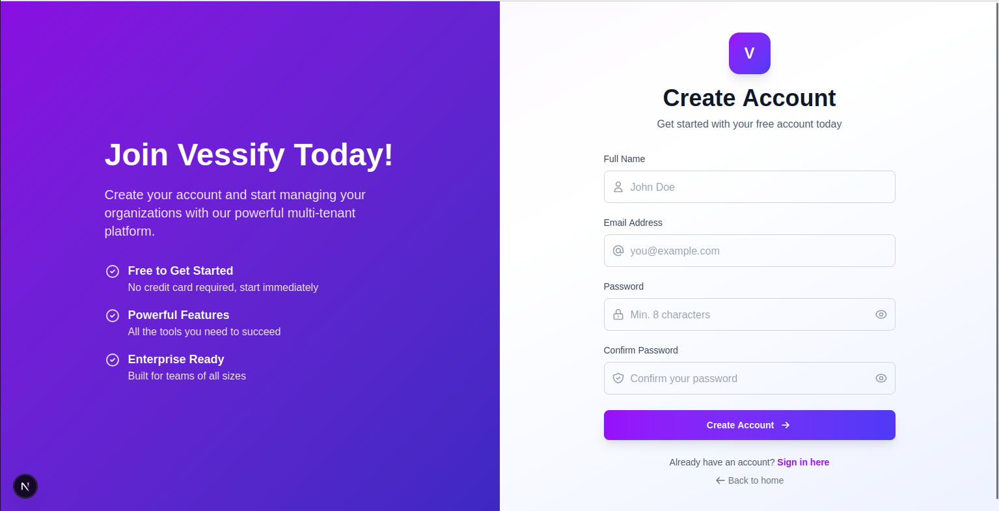
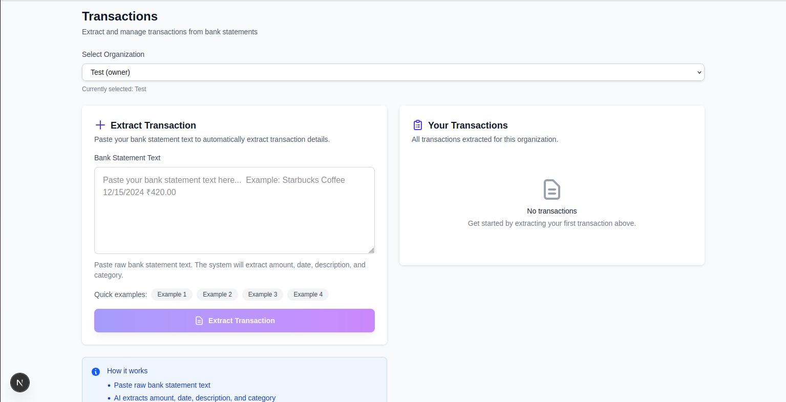

# Project Overview - Vessify Frontend

## What is Vessify?

Vessify is a multi-tenant financial transaction management platform that helps users extract and organize bank transactions using AI. The frontend provides a clean, modern interface for user authentication, organization management, and transaction processing.

## Key Features

### 1. User Authentication
Secure login and registration system with email verification.

**Sign In Page**

- Email and password authentication
- Password visibility toggle
- "Back to home" navigation
- Link to registration page
- Clean split-screen design with feature highlights

**Registration Page**

- Full name, email, and password fields
- Password confirmation
- Minimum 8 character password requirement
- Account creation with email verification
- Link back to login page

### 2. Dashboard & Profile Management

**User Profile Dashboard**

The dashboard provides two main tabs:
- **Profile Tab** - View user information and session details
- **Organizations Tab** - Manage your organizations

**Profile Information Displayed:**
- User's full name
- Email address
- Unique user ID
- Email verification status
- Session duration (7 days)
- Session security details

**Navigation:**
- Top navbar with user email and sign out button
- Quick access to Home and Transactions pages

### 3. Organization Management

**Organizations View**

Multi-tenant support allows users to:
- Create multiple organizations
- Switch between organizations
- Manage organization members (coming soon)
- Role-based access control (owner, admin, member)

**First-time users see:**
- Empty state with helpful message
- "Create Organization" button prominently displayed
- Clear call-to-action to get started

### 4. Transaction Extraction & Management

**Transactions Page**

The main feature of Vessify - AI-powered transaction extraction from bank statements.

**Left Panel - Extract Transaction:**
- Organization selector dropdown (shows user's role)
- Large text area for pasting bank statement text
- Quick example buttons (Example 1-4) to try the feature
- Clear instructions and placeholder text
- Purple "Extract Transaction" button
- "How it works" info section at the bottom

**Right Panel - Your Transactions:**
- List of all extracted transactions for selected organization
- Empty state when no transactions exist
- Helpful message to get started

**How It Works:**
1. Select an organization from the dropdown
2. Paste raw bank statement text into the form
3. AI automatically extracts:
   - Transaction amount (₹ Indian Rupees)
   - Transaction date
   - Merchant description
   - Category (Food, Shopping, Transport, etc.)
4. View all transactions in the right panel
5. Transactions are saved per organization

## User Flow

### For New Users:
1. **Register** → Enter name, email, and password
2. **Verify Email** → Click link sent to email (if AWS SES configured)
3. **Login** → Enter credentials
4. **Dashboard** → View profile information
5. **Create Organization** → Switch to Organizations tab
6. **Go to Transactions** → Click "Transactions" in navbar
7. **Select Organization** → Choose from dropdown
8. **Extract Transaction** → Paste bank statement text
9. **View Results** → See extracted transaction details

### For Returning Users:
1. **Login** → Credentials remembered for 7 days
2. **Dashboard** → Automatically redirected if already logged in
3. **Quick Access** → Navigate to Transactions
4. **Switch Organizations** → Use dropdown to change context
5. **Continue Working** → Extract more transactions

## Design Highlights

### Color Scheme
- **Primary:** Indigo/Purple gradient (`#6366f1` to `#9333ea`)
- **Background:** Light gray (`#f9fafb`)
- **Cards:** White with subtle shadows
- **Text:** Dark gray for content, lighter gray for labels

### Layout Structure
- **Split-screen auth pages** - Feature highlights on left, form on right
- **Responsive design** - Works on desktop, tablet, and mobile
- **Card-based UI** - Clean cards with clear sections
- **Consistent spacing** - Uniform padding and margins throughout

### UI Components
- **Buttons:** Rounded, gradient backgrounds, hover effects
- **Forms:** Clear labels, placeholder text, validation
- **Navigation:** Fixed top navbar with user controls
- **Empty States:** Helpful messages with icons
- **Dropdowns:** Custom styled select boxes with role badges

## Technology Stack

- **Framework:** Next.js 16 with App Router
- **UI Library:** React 19
- **Styling:** Tailwind CSS v4
- **Authentication:** NextAuth.js (Auth.js)
- **State Management:** React hooks
- **HTTP Client:** Fetch API
- **Type Safety:** TypeScript

## Pages & Routes

| Route | Page | Description |
|-------|------|-------------|
| `/` | Landing Page | Welcome page with Get Started/Sign In buttons |
| `/login` | Sign In | User authentication |
| `/register` | Create Account | New user registration |
| `/verify-email` | Email Verification | Verify email with token |
| `/dashboard` | Dashboard | User profile and organizations |
| `/dashboard/transactions` | Transactions | Extract and manage transactions |

## Security Features

- **Protected Routes:** Middleware checks authentication
- **Session Management:** 7-day JWT tokens
- **Password Validation:** Minimum 8 characters required
- **CORS Protection:** Frontend only accepts requests from configured backend
- **Email Verification:** Required before full access (if enabled)

## Responsive Design

The application is fully responsive and works across:
- **Desktop:** Full layout with side-by-side panels
- **Tablet:** Adjusted spacing and font sizes
- **Mobile:** Stacked layout, collapsible navigation

## What Makes Vessify Special

1. **AI-Powered Extraction** - No manual data entry needed
2. **Multi-Tenant Architecture** - Manage multiple organizations seamlessly
3. **Clean Modern UI** - Professional design that's easy to use
4. **Fast & Efficient** - Built with Next.js for optimal performance
5. **Type-Safe** - TypeScript ensures fewer bugs
6. **Secure** - Industry-standard authentication and session management

## Next Steps

To get started with the frontend:
1. See [Setup Guide](./setup.md) for installation instructions
2. Check [Tech Stack](./tech-stack.md) for detailed technology information
3. Review [API Documentation](../backend/api-reference.md) for backend integration

---

*Note: Screenshots show the actual application interface. Some features may require backend configuration (AWS Bedrock for AI, AWS SES for emails).*
